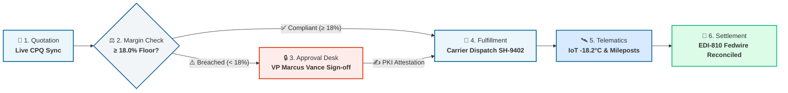
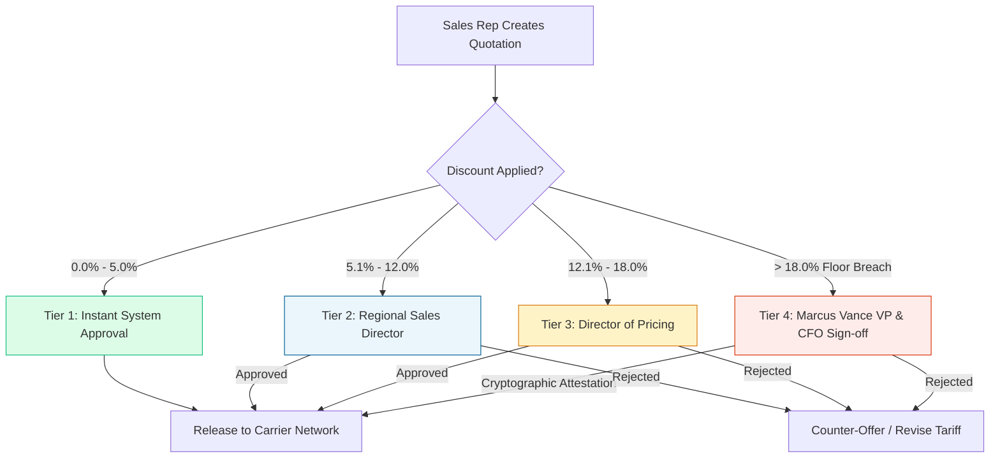

<div align="center">

# ⚡ DealFlow360
### Autonomous Multi-Modal Logistics CPQ & Deal Execution Platform
**Turn Every Deal Into Momentum — From Quotation to Cash.**

[](https://react.dev/)
[](https://vitejs.dev/)
[](https://tailwindcss.com/)
[]()
[]()
[]()

<br/>

[🚀 Quickstart](#-quickstart) • [✨ Key Highlights](#-key-highlights) • [🧭 17 Unified Screens](#-17-unified-enterprise-screens) • [🛡️ CPQ Margin Guard](#️-autonomous-cpq-margin-guard) • [📐 Architecture](#-deal-execution-architecture) • [⌨️ Shortcuts](#️-productivity-shortcuts)

</div>

---

## 🌟 Overview

**DealFlow360** is an enterprise-grade CPQ (Configure, Price, Quote) and multimodal freight execution operating system. Engineered for global carriers, 3PL freight forwarders, and institutional shippers, DealFlow360 eliminates margin erosion and friction by connecting commercial pricing policy, risk auditing, live carrier telematics, and automated quote-to-cash settlement into a single, cohesive **Single Page Application (SPA)**.

> [!IMPORTANT]
> **Zero Reloads, 100% Pure React 18**: Built from the ground up by fusing 17 operational and customer-facing interfaces into one ultra-responsive application with global context state, keyboard-driven navigation (`⌘K`), and live telemetry simulation.

---

## ✨ Key Highlights

```
  ┌───────────────────────┐   ┌───────────────────────┐   ┌───────────────────────┐
  │   17 Unified Views    │   │  18.0% Hard Margin    │   │  -18.2°C Telematics   │
  │  Quote, Dispatch, Pay │   │ Programmatic Safeguard│   │ Live IoT Reefer Feeds │
  └───────────────────────┘   └───────────────────────┘   └───────────────────────┘
  ┌───────────────────────┐   ┌───────────────────────┐   ┌───────────────────────┐
  │   Command Palette ⌘K  │   │  3-Way EDI Match      │   │   1.1s Vite Build     │
  │ Instant Fuzzy Search  │   │ Quote + Waybill + Pay │   │ Lightning Fast HMR    │
  └───────────────────────┘   └───────────────────────┘   └───────────────────────┘
```

| Capability | What It Delivers |
|---|---|
| 🚢 **Multi-Modal CPQ Engine** | Real-time rate calculation across **Ocean FCL/LCL**, **Air Expedited**, **Class 1 Rail**, and **Over-The-Road (FTL)** with dynamic bunker/fuel surcharges. |
| 🛡️ **Algorithmic Margin Guard** | Strict **18.0% Gross Margin Hard Floor** with automated multi-tier approval delegation (Sales Rep &rarr; Regional Director &rarr; Pricing Desk &rarr; VP/CFO). |
| 🛰️ **IoT Telematics & Waypoints** | Real-time sensor monitoring for cold-chain reefers (**-18.2°C telemetry**), GPS milepost tracking, and port terminal milestones. |
| 💳 **3-Way Automated Settlement** | EDI-810 gateway reconciling **Quotation (`Q-1024`)** &harr; **Carrier Waybill (`SH-9402`)** &harr; **Invoice (`INV-2024-8891`)** with multi-party carrier payout splits. |
| ⌨️ **Command Center (`⌘K`)** | Global fuzzy-search palette allowing instantaneous jumping to any quotation, active waybill, invoice, or navigation module. |
| 📊 **Real-time Risk Intelligence** | Interactive scatter plot matrix mapping active contracts across margin percentage vs. commitment volume with SLA breach countdowns. |

---

## 📐 Deal Execution Architecture



---

## 🛡️ Autonomous CPQ Margin Guard

DealFlow360 stops margin degradation before contracts can be dispatched:



### Delegated Authority Matrix

| Tier | Discount Concession | Minimum Margin | Approval Authority | SLA Target |
|:---:|:---:|:---:|:---:|:---:|
| **Tier 1** | `0.0% - 5.0%` | &ge; 25.0% | **Automated Instant Sign** | Real-time (&lt; 1s) |
| **Tier 2** | `5.1% - 12.0%` | &ge; 20.0% | **Regional Sales Director** | 4 Hours |
| **Tier 3** | `12.1% - 18.0%` | &ge; 18.0% | **Director of Pricing** | 2 Hours |
| **Tier 4** | `> 18.0%` *(Hard Lock)* | &lt; 18.0% | **Marcus Vance (VP) & CFO** | 45 Minutes *(Rate-Lock Expiry)* |

---

## 🧭 17 Unified Enterprise Screens

The entire suite lives modularly inside [`src/pages/`](src/pages/) with instant, flicker-free client transitions:

### 🌐 Public & Customer-Facing
- **[1. Public Landing Page](src/pages/LandingPage.jsx)** (`'landing'`): Dynamic hero section, interactive quotation and waybill tracking card, enterprise stats bar, and direct platform launcher.
- **[2. Customer Portal 360°](src/pages/CustomerPortal.jsx)** (`'customer-portal'`): Account 360 view for institutional shippers (Acme Global, Falcon Aerospace, Pacific Rim) with credit facilities, DSO metrics, and active orders.

### 💼 Commercial CPQ & Governance
- **[3. Dashboard Overview](src/pages/DashboardOverview.jsx)** (`'overview'`): Delegated authority discount tiers, hard margin safeguards, corridor rule setup, and workflow simulation.
- **[4. Quotations List](src/pages/QuotationList.jsx)** (`'quotations'`): Live CPQ sync pipeline, multi-status filters (All, Awaiting, Drafts, Converted), batch approvals, and CSV export.
- **[5. Quotation Details](src/pages/QuotationDetails.jsx)** (`'quotation-detail'`): Single-deal view (`Q-1024`), 5-stage lifecycle stepper, tariff breakdowns, and interactive commercial concession slider.
- **[6. Approvals & Governance](src/pages/ApprovalsList.jsx)** (`'approvals'`): High-severity SLA expiration banner (&lt; 45m rate locks), exception queue, and fast-track filtering.
- **[7. Approval Request Details](src/pages/ApprovalDetails.jsx)** (`'approval-detail'`): Single-request authorization (`AP-8821`), deal economics breakdown (-6.2% floor variance), and PKI electronic signature attestation.
- **[8. Deal Health & Risk Intelligence](src/pages/DealHealth.jsx)** (`'deal-health'`): Interactive SVG scatter plot matrix, clickable deal bubbles, algorithmic stress testing, and churn alerts.

### 🚚 Fulfillment & Fleet Execution
- **[9. Fulfillment & Carrier Dispatch](src/pages/FulfillmentList.jsx)** (`'fulfillment'`): Freight dispatches, terminal milestones, active bills of lading, and carrier SLA monitoring.
- **[10. Fulfillment Order Details](src/pages/FulfillmentDetails.jsx)** (`'fulfillment-detail'`): Waybill `SH-9402` GPS waypoints (Port Newark &rarr; Bethlehem &rarr; Chicago Corwith), -18.2°C Reefer IoT telematics, and real-time ping updates.

### 💰 Invoicing & Quote-to-Cash
- **[11. Enterprise Invoices & Billing](src/pages/InvoicesList.jsx)** (`'invoices'`): Receivables aging buckets, EDI-810 gateway statuses, batch reconciliation, and manual invoice generator.
- **[12. Invoice Details](src/pages/InvoiceDetails.jsx)** (`'invoice-detail'`): `INV-2024-8891` line items, automated 3-way match verification (Quote + Waybill + Ingate milestone), and Fedwire clearing reference.
- **[13. Settlement & Ledger Balancing](src/pages/BillingDetails.jsx)** (`'billing-detail'`): `INV-88291` multi-party carrier payout vs platform margin split and ACH wire settlement recorder.

### 📦 Catalog, Contracts & Compliance
- **[14. Products & Catalog](src/pages/ProductDashboard.jsx)** (`'products'`): Multi-modal freight inventory (Ocean, Air, Rail, Truckload), Cass index sync, and carrier price books.
- **[15. Product SKU Details](src/pages/ProductDetails.jsx)** (`'product-detail'`): `SKU-OCN-40HC` 40ft High-Cube Reefer technical machinery specs and dynamic tariff pricing formula.
- **[16. Enterprise Subscriptions](src/pages/SubscriptionList.jsx)** (`'subscriptions'`): Recurring carrier network allocations, software seats, $18.4M ARR metrics, and renewal health.
- **[17. Admin & Compliance Governance](src/pages/AdminReport.jsx)** (`'admin-report'`): Immutable cryptographic audit trail, SOX-404 verification, and delegated commercial authority logs.

---

## ⌨️ Productivity Shortcuts

| Keybinding | Action | Context |
|---|---|---|
| <kbd>⌘</kbd> + <kbd>K</kbd> / <kbd>Ctrl</kbd> + <kbd>K</kbd> | Open **Global Command Palette** | Anywhere |
| <kbd>ESC</kbd> | Dismiss modals, search palette, or active drawer | Anywhere |
| Click **"Track Shipments"** | Quick jump to fulfillment or quotes | Landing Page |
| Click **"Launch Enterprise App"** | Seamless entry into CPQ Dashboard | Landing Page |

---

## 📁 Repository Structure

```text
frontend/
├── index.html                  # HTML entry point with Material Symbols & fonts
├── package.json                # React 18, Vite 5, Tailwind CSS
├── vite.config.js              # Vite bundler configuration
├── tailwind.config.js          # DealFlow360 design tokens & colors
├── run.bat                     # Double-click launcher (starts server & opens browser)
├── stop.bat                    # Double-click stopper (clean process termination)
└── src/
    ├── App.jsx                 # Top-level application shell & screen router
    ├── index.css               # Design system classes, typography & custom badges
    ├── main.jsx                # React root mount
    ├── context/
    │   └── AppContext.jsx      # Global state (screen, search, notifications, active deals)
    ├── components/
    │   ├── Sidebar.jsx         # Enterprise navigation drawer
    │   ├── Header.jsx          # Top bar with live stats & search trigger
    │   ├── CommandPalette.jsx  # ⌘K global quick-search modal
    │   ├── NewQuotationModal.jsx # Quick quote creation modal
    │   └── Toast.jsx           # Real-time alert notifications
    └── pages/                  # 17 complete enterprise screens
        ├── LandingPage.jsx
        ├── DashboardOverview.jsx
        ├── QuotationList.jsx
        ├── QuotationDetails.jsx
        ├── ApprovalsList.jsx
        ├── ApprovalDetails.jsx
        ├── DealHealth.jsx
        ├── FulfillmentList.jsx
        ├── FulfillmentDetails.jsx
        ├── InvoicesList.jsx
        ├── InvoiceDetails.jsx
        ├── BillingDetails.jsx
        ├── CustomerPortal.jsx
        ├── ProductDashboard.jsx
        ├── ProductDetails.jsx
        ├── SubscriptionList.jsx
        └── AdminReport.jsx
```

---

## 🚀 Quickstart

### Option A: One-Click Launchers (Windows)
- **Start the Application**: Double-click [`run.bat`](run.bat) from `frontend/` (or run `run_dev.bat` from repository root)
- **Stop the Application**: Double-click [`stop.bat`](stop.bat)

### Option B: Command Line

#### 1. Install Dependencies
```bash
cd frontend
npm install
```

#### 2. Start Dev Server
```bash
npm run dev
```
> The application will start immediately at **[http://localhost:5173](http://localhost:5173)** with hot module replacement (HMR).

#### 3. Build for Production
```bash
npm run build
```
> Compiles a minified, production bundle into `dist/` in **~1.1s**.

---

## 🛠️ Tech Stack & Design System

- **Core Engine**: [React 18.3](https://react.dev/) (Hooks, Context, Client Routing)
- **Build Tool**: [Vite 5.4](https://vitejs.dev/) (ESM, lightning-fast HMR)
- **Styling**: [Tailwind CSS 3.4](https://tailwindcss.com/) with enterprise logistics color palette
- **Iconography**: Google Material Symbols Outlined
- **Typography**: Google Fonts *Inter* & *Plus Jakarta Sans*

---

<div align="center">

**DealFlow360 Enterprise Logistics** • Built with ❤️ for scalable freight intelligence.

</div>
